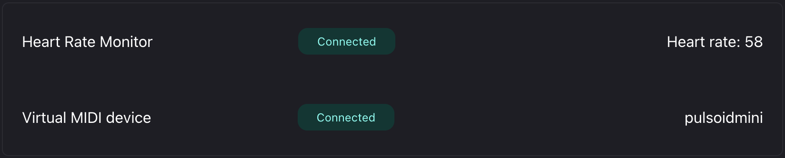

# Pulsoid VRchat World Integration
## High Level Approach

At a high level, Pulsoid exposes heart rate data via the Pulsoid MIDI Protocol. A VRChat world can listen to the beats per minute transmitted through [MIDI](https://creators.vrchat.com/worlds/udon/midi/). As a result, the VRChat world can receive and react to this data.

We’ve provided prefabs for Unity, but you’re free to integrate them in your own way. 
The Demo World showcases the following features:
- Displaying all heart rates on a board
- Changing the floor color based on the combined heart rate
- Showing individual heart rate on the wrist

(Pulsoid MIDI Protocol)[https://docs.pulsoid.net/vr-chat/vrchat-world-integration#pulsoid-midi-protocol]

In this documentation we use P.V.W.I as an abbreviation for Pulsoid VRChat World Integration

## Pulsoid Demo Tech World

You can expierence our integration in specially created Pulsoid Demo Tech World!

1. Visit [https://pulsoid.net/ui/midi](https://pulsoid.net/ui/midi) to setup the integration.
In the end you should be in a similar state:

2. Join Pulsoid Tech Demo World in VRChat

For any additional information contact us:
- contact@pulsoid.net
- #vrchat at [discord](https://pulsoid.net/s/discord)
- technical details [Pulsoid MIDI Protocol](https://docs.pulsoid.net/vr-chat/pulsoid-midi-protocol)

### What Is P.V.W.I and what can it be used for? 
P.V.W.I was made for the purpose of integrating the players heart rate data into the World side of VRChat allowing world creators to implement code and game features based around the players heart rate.

Some of the following are idea you could implement into VRChat Using P.V.W.I:

- Mood lighting based upon the average heart rate in the world instance.
- Develop a game that uses the players heart rate to determine the real time difficulty curve of the game.
- Develop a fitness game for players that will have extra data like heart rate to track the players progression.
- Develop anything you like with the heart rate data, it is yours to toy arround with. Your imagination is the limit.  

Within the world of VRChat or twitch you’ve most likely already seen someone using Pulsoid tech to display their heart rate in a fun and entertaining way. Now why not include that inside of your games in VRChat

## Installation

1. Download [P.V.W.I.UnityPackage](https://github.com/pulsoid-oss/pulsoid-vrchat-integration/blob/main/P.V.W.I.unitypackage) 

2. Open your VRChat world Project and open the P.V.W.I.UnityPackage file and it should install all the needed files in a folder called P.V.W.I

3. A pop up should appear asking for you to install Text Mesh Pro, install both TMP and the TMP addons

4. Once this is done you will have installed the needed files for the P.V.W.I to work and we are ready to move on to the next step

## Setup
Moving into the Setup of P.V.W.I we will need to head into the prefabs folder. 

Inside the prefabs folder you will find all the prefabs we have provided you with. 

You should be able to see a prefab called H.R.T ( heart rate calculator)

If you are going to be adding on to P.V.W.I please keep in mind that the H.R.T only runs locally and is not networked. If you want to get everyone’s Heart Rate you will ether need to make an array yourself calling to everyone in the world or just call to our the SDS.slots[].

HR in the H.R-I.B prefab to get that slots Heart Rate (this does use the script on the H-R.I.B prefab so you’ll need to add it into the project as well. We will talk about this later in the documentation)

Now you will want to drag and drop this into your project to add it into the world, this will take the midi data coming in from the user and will decode it into the players heart rate so that we can use it later on.

### List of Prefabs

Inside of the prefabs folder you will find the following prefabs:

- H.R.T (Heart Rate Calculator)
- [H.R-I.B (Heart Rate - Indication Board)](#hrib)
- [H.R-A.L (Heart Rate - Ambient Light )](#hral)
- [H-H.R.B Offset Holder (Head – Heart Rate Board)](#hhrb-offset)
- [H-H.R.B Spawner (Head – Heart Rate Board Spawner)](#hhrb-spawner)
- [W-H.R.B (local only) (Wrist – Heart Rate Board)](#whrb)

We will now go into detail about what each prefab is and how each one works.

**All prefabs are set up automatically and can just be dragged into the scene without any need to edit them or set them up.**

####  H.R-I.B ( HEART RATE -  INDICATION BOARD) 
H.R-I.B is ran by the instance owner only, all of the networking and code is sent through them.

When a player(s) join the instance the owner will look through an array of 64 slots and will allocate a slot to that player giving them ownership and turning the slot on for everyone so that everyone can see it.

#### H.R-A.L ( HEART RATE -  AMBIENT LIGHT) 
H.R-A.L collects everyones heart rate by calling into the SDS script run on the H.R-I.B prefab, it calls to get the slot update script on the first slot and get the heart rate from it by doing SDS.Slots[i].

HR Slots, this holds the script inside of every slot and inside of that script that players Heart rate is stored. Once the script has gotten this it adds the number to a int and does it for every other Heart Rate that is over 0 then it divides the total by the amount of slots we pulled a Heart rate from And set a the color of all the lights inside of it as one of 4 colors depending on how high the average heart rate is, this updates every 5 seconds

####  H-H.R.B Offset Holder (HEAD - HEART RATE BOARD) 
H-H.R.B Offset Holder is very simple and has no code inside of it apart from the code inside of the child object that will move the H-H.R.B above the owning players head while showing their heart rate above their head by calling directly to the H.R.T ( heart rate calculator) script to get the owning players heart rate, the player then syncs this variable with everyone in the instance and then proceeds to show it on the UI now above their head. 

#### H-H.R.B Spawner (HEAD -  HEART RATE BOARD) 
H-H.R.B Spawner works in the exact same same way that the H.R-I.B works, it's the same code just with some variables changed and what object it gives away changed. Everything else is the same. 

When a player loads in the owning player checks an array of 64 objects finds one that is not in use and gives it to that player then giving that player ownership of that object. 

#### W-H.R.B(local only)(WRIST -  HEART RATE BOARD) 
W-H.R.B works basically the same as the H-H.R.B however it is local only and instead of being over the player head it is attached to their wrist. Again it is the same code with some variables changed and without the networking, as it is local only you’ll only ever need one in the instance. 

# Credits
Developed and made By: BassBoostedDuck
Discord: BassBoostedDuck 
[Portfolio](https://bayleighhalifaxwor.wixsite.com/game-dev-portfolio)
